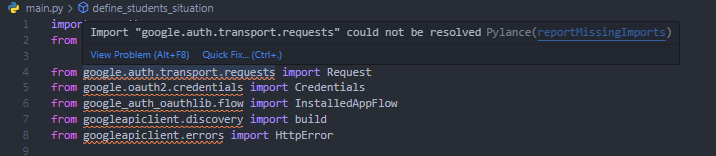
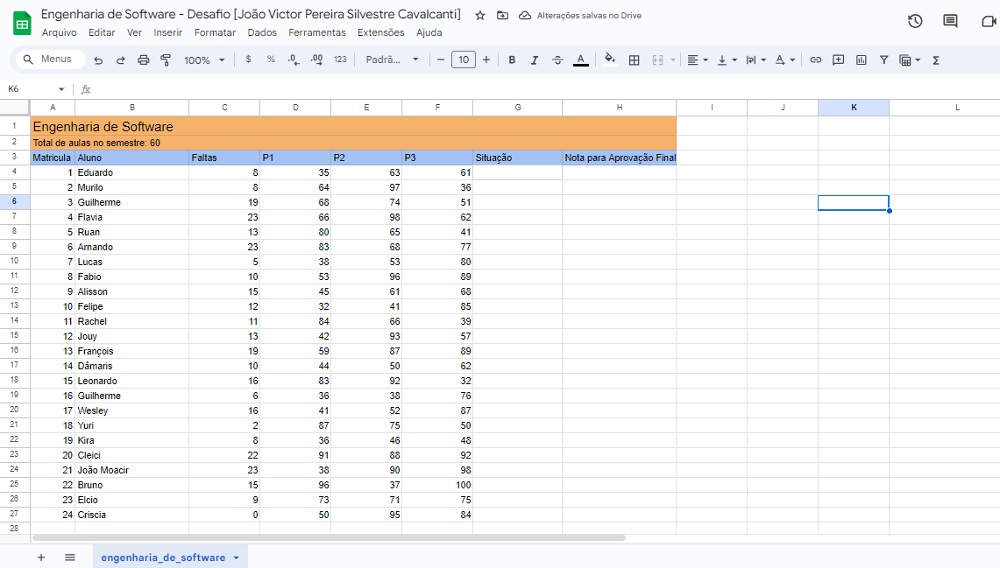
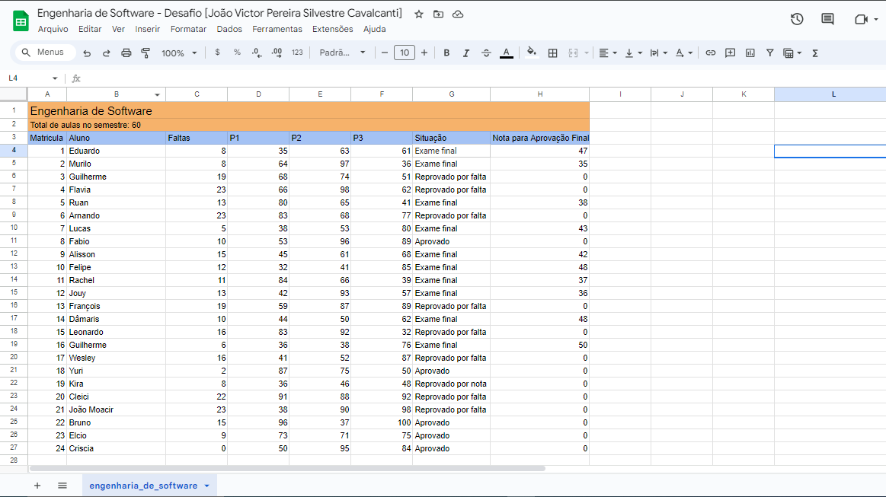

# Desafio-TuntsRocks
Desafio de código para realizar alterações em planilhas feito para processo seletivo.

## Adendo de Segurança

Visto que para acessar planilhas no google através da linguagem que escolhi (Python) é
necessário criar uma chave com minhas credenciais e token de autenticação, optei por
por fazer isso com uma segunda conta de email que possuo mas não a utilizo para questões
pessoais.  

# Como rodar o código 

Primeiramente certifique-se de que python esteja instalado em seu computador com a versão mais atual.
Caso esse não seja o caso clique [aqui](https://www.python.org/downloads/) e siga o processo
de instalação do python.

Você pode checar se está tudo instalado corretamente rodando em seu terminal os comandos :

``` bash
python --version
```

```bash
pip --version
```

Pip é o sistema de gerenciamento de pacotes que também será utilizado neste projeto, ele vem junto 
com python na instalação então não há necessidade de mais instalações.

## Google API

Para esse projeto também será necessário instalar as dependências da api do google, que pode ser
feita rodando o seguinte comando em seu terminal :

``` bash
pip install --upgrade google-api-python-client google-auth-httplib2 google-auth-oauthlib
```

## Comando para rodar código

Após fazer a instalação de todas as dependências será possível rodar o código principal.
Com o terminal aberto neste repositório rode o seguinte comando :

```bash
python main.py
```

ou caso a primeira opção não funcione :

```bash
python3 main.py
```

obs.: Caso em sua IDE os imports do arquivo main.py estejam com warnings como na imagem abaixo
, ignore-os o código deve funcionar da mesma forma.



Então após todos esses passos será possível ver as alterações na planilha com as situações
de todos os alunos e caso estejam em exame final a nota necessária para passar será exibida
na sua devida coluna.

Antes das alterações:



Após alterações:




O link para a planilha será enviado na entrega do projeto.